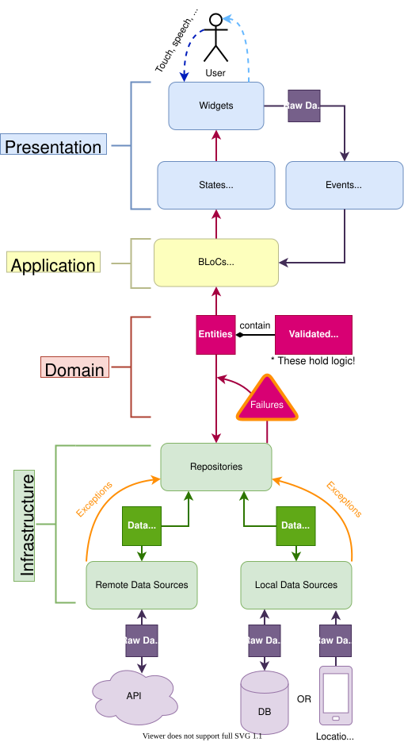
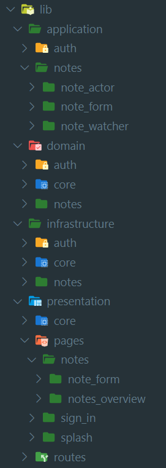

# Moloch App

Este es un proyecto de Moloch.

## Patrón de diseño

Este proyecto utiliza el patrón de diseño Domain Driven Design (DDD) (Eric Evans, 2003).



## Estructura del proyecto



## Dependencias principales

- **fpdart** (Programacion funcional) <a href="https://flutter.dev/docs/development/packages-and-plugins/favorites"><span style="color:lightblue">Flutter favorite</span> </a>

- **flutter_bloc** (Manejador de estados) <a href="https://flutter.dev/docs/development/packages-and-plugins/favorites"><span style="color:lightblue">Flutter favorite</span> </a>

- **freezed** (Generación de código) <a href="https://flutter.dev/docs/development/packages-and-plugins/favorites"><span style="color:lightblue">Flutter favorite</span> </a>

- **Autoroute** (Gestion de rutas)
- **Injectable** (Inyección de dependencias)

## Configuración del entorno de desarrollo

### Flutter 3.29.2 (FVM configurado)

1. Ejecutar en la terminal (CMD)

```
dart pub global activate fvm
```

2. Agrega lo siguiente en Preferences: Open User Settings (JSON) (CMD + SHIFT + P):

```
  //FVM
  "dart.flutterSdkPath": ".fvm/versions/3.29.2",
  "search.exclude": {
    "**/.fvm": true
  },
  "files.watcherExclude": {
    "**/.fvm": true
  }
```

3. Ejecutar en la terminal (en la ruta del proyecto)

```
   fvm use 3.29.2
```

4. Reiniciar VScode (si no se reinicia no podra tomar los nuevos cambios)

```
   Cerrar la terminal abierta en VSC dandole click al icono de basura y cerrar todo VSC y volverlo a abrir para que cargue las configuraciones nuevas
```

5. Ejecutar en la terminal (en la ruta del proyecto)

```
   flutter doctor (varificar que indique que si estas usando la version correcta especificacda anteriormente)
```
6. Agregar las siguientes lineas al archivo .vscode/settings.json
 
```
  {
    "[typescript]": {
      "editor.defaultFormatter": "esbenp.prettier-vscode"
    },
    "[jsonc]": {
      "editor.defaultFormatter": "esbenp.prettier-vscode"
    },
    "[dart]": {
      "editor.formatOnSave": false,
      "editor.formatOnType": true,
      "editor.rulers": [
        80,
      ],
      "editor.selectionHighlight": false,
      "editor.suggest.snippetsPreventQuickSuggestions": false,
      "editor.suggestSelection": "first",
      "editor.tabCompletion": "onlySnippets",
      "editor.wordBasedSuggestions": "off"
    },
    "search.exclude": {
      "**/.fvm": true
    },
    "files.watcherExclude": {
      "**/.fvm": true
    }
  }
```

## Primeros pasos

1. Copia el archivo env.develop y pegalo en la misma ruta.
2. Renombra el archivo copiado como .env

### Ultimos pasos

Utiliza la consola para correr los siguientes comandos.

```
flutter clean
flutter pub get
flutter gen-l10n
flutter pub run build_runner build --define flutter_secure_dotenv_generator:flutter_secure_dotenv=OUTPUT_FILE=encryption_key.json
```

### Para debugguear en web 
agregar el archivo launch.json a la carpeta .vscode
